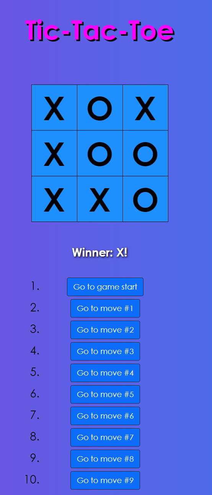

# Tic-Tac-Toe
## Project Information
This app was created following alongside the official tutorial from ReactJS that can be found here: [React Tutorial](https://reactjs.org/tutorial/tutorial.html).
The application was deployed with Vercel and can be interacted with the following link:  [Tic-Tac-Toe](https://tic-tac-toe-lake-mu.vercel.app/)
This project was bootstrapped with [Create React App](https://github.com/facebook/create-react-app).

## Project Goals
The main objective of this project was for me to become more familiar with React as a whole. 
Through the completion of this tutorial I was able to gain a greater understanding of the following:
* Class components in React
* Using the constructor method in conjuction with props and super(props)
* Using the **this** keyword
* Managing state
* React hooks inlcuding useState and useEffect(not implemented in final project, but used during it's creation)

## Application Preview

